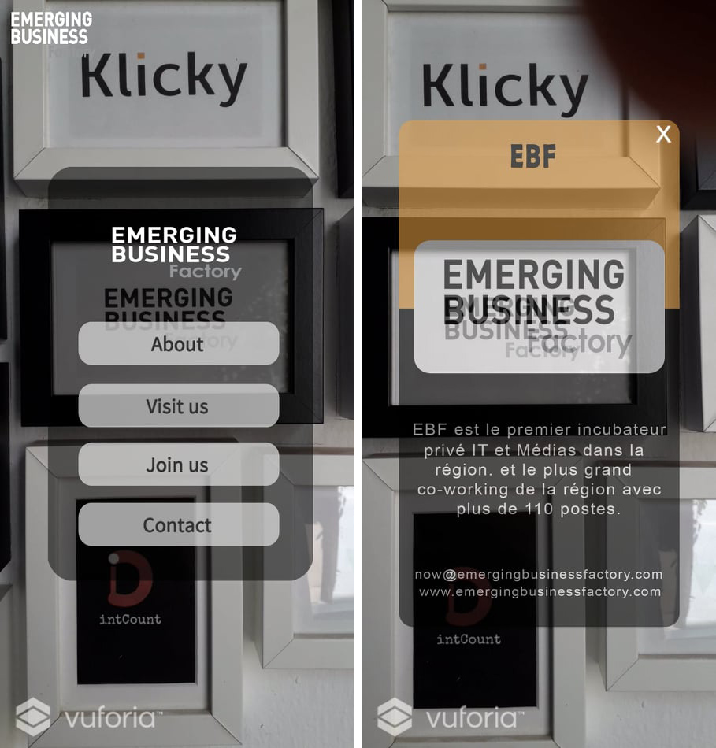
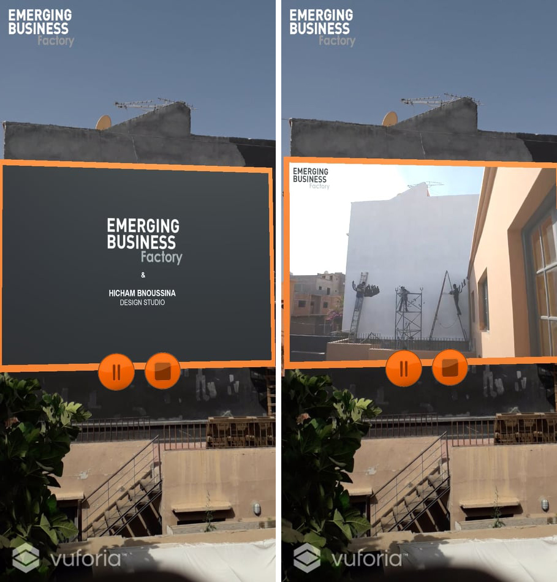
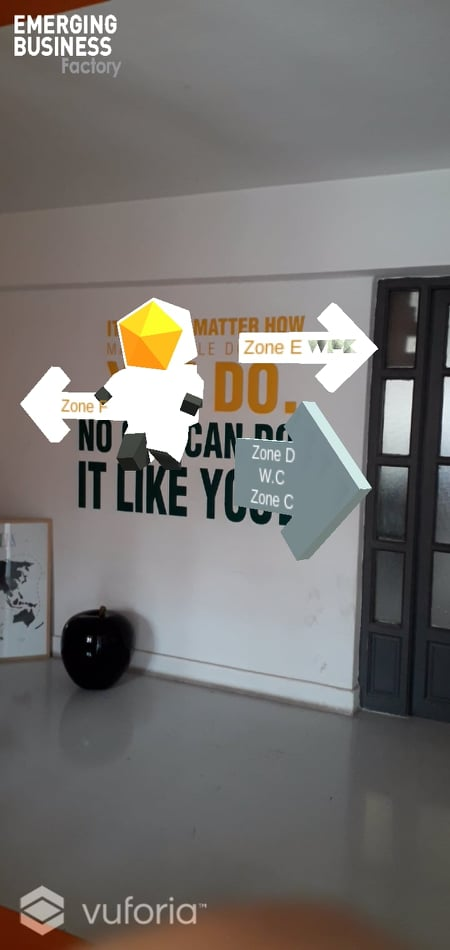
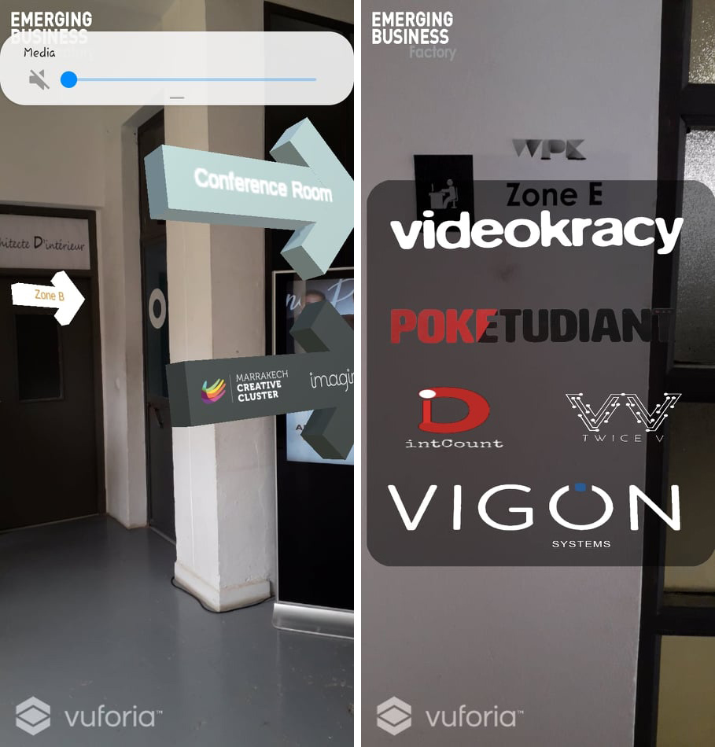
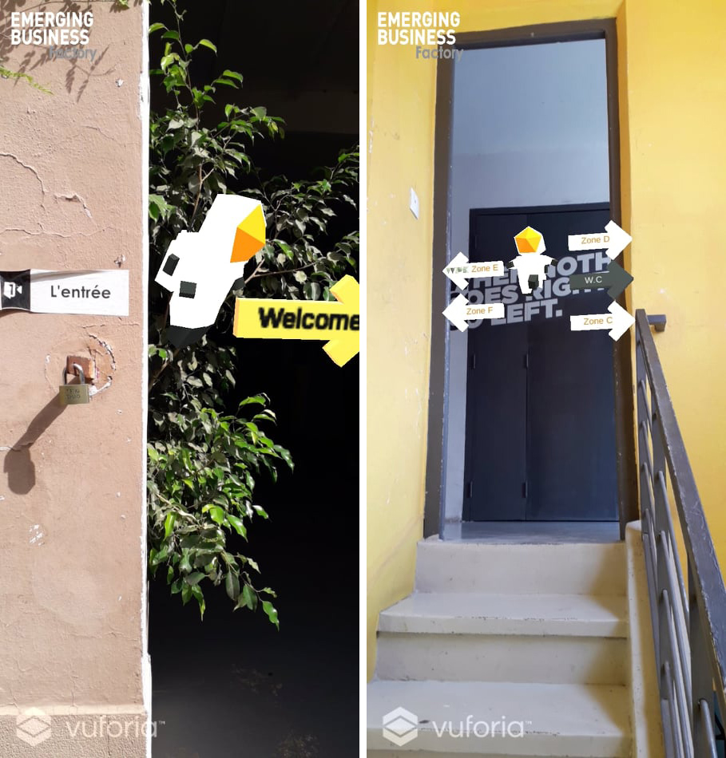
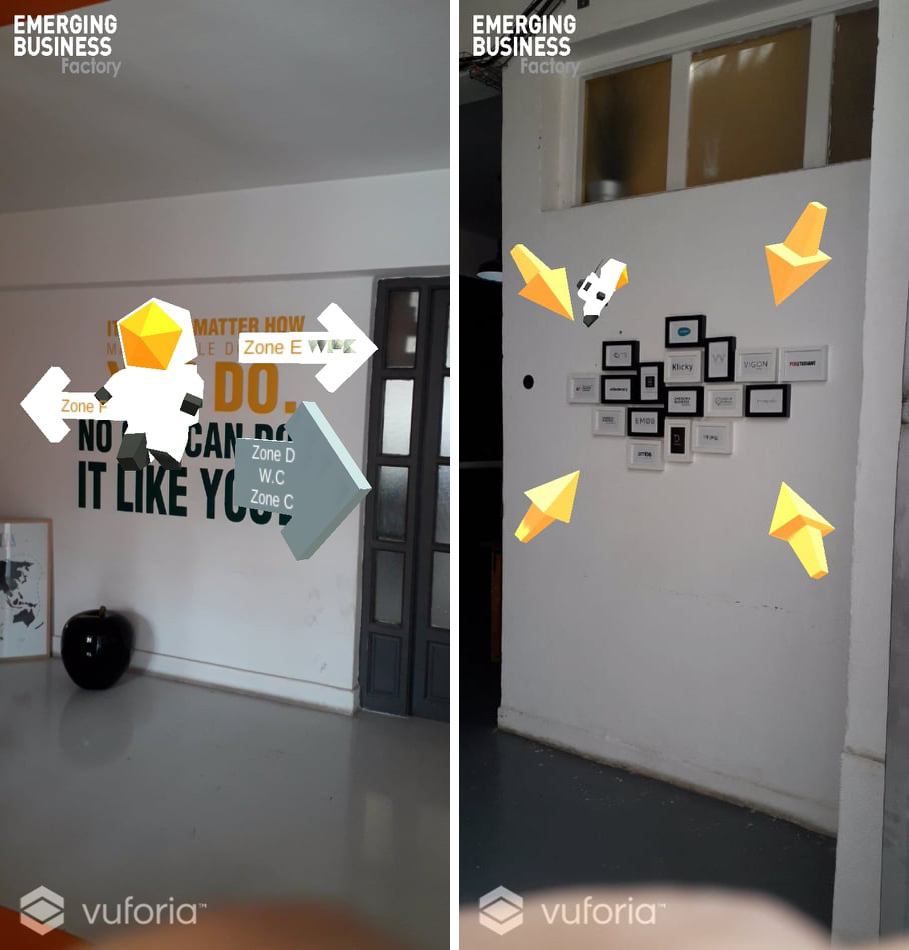
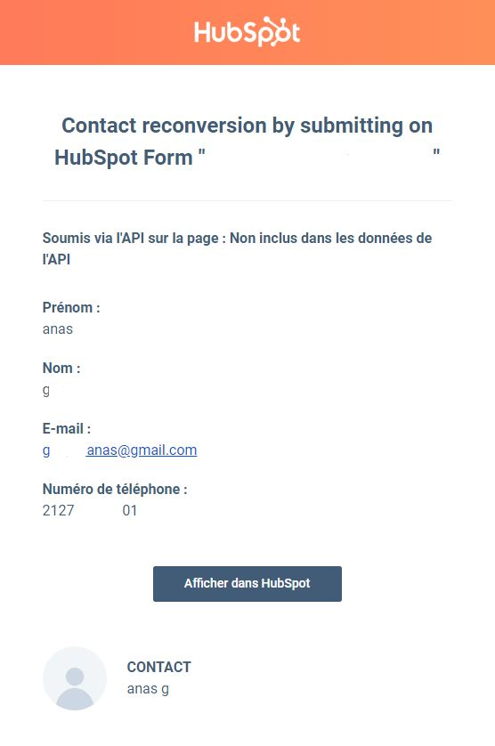

# AR Guide

> Cette page touche les 3 grandes sections de l'application : Stands, Parcours du jardin, et Général.

## Mise en situation

- <code>Client :</code> Royal Mansour Marrakech

- <code>Projet :</code> application mobile Android / iOS en Augmented Reality pour les invités de l’évènement

- <code>Lieu :</code> Jardin de l'hotel Royal Mansour Marrakech

- <code>Date de l'évènement :</code> Début septembre

- - - -

## Fonctionnalités possibles

> Les fonctionnalités citées sont regroupées selon le lieu.

### Stands

- Afficher une description du stand / thematique.
    > Une fenetre s'affiche en dessus de la caméra, et contient les informations concernant le stand en question.

- Afficher le menu des repas de chaque stand 
    > Ce menu peut contenir d'autres menus, des boutons cliquables, ouvrir des liens, des numéros de téléphone.

- - - -

- Lancer une video documentaire courte sur le stand / thematique.
    > Affiche une video quand l'utilisateur scanne un élèment clé. la video peut être mise en pause, ou redémarrée.

- - - -

- Affiche un Guide en 3D à côté du stand qui le présente en audio.
    > Le guide se pose à côté du stand, et explique la thématique, et disparaît à la fin de la présentation.

### Parcours du jardin

- Affiche une carte qui contient la position actuelle, et redirige vers les facilités / stands / repères à proximité.
    > Affiche une carte zoomable interactive du jardin avec des points cliquables pour naviguer.

    > La liste des facilités à proximité est cliquable, chacune ouvre un menu qui contient des choix, menus et informations sur celle-ci.

- Un plan de visite de l’intégralité du jardin avec des checkpoints tout au long, et un guide parlant à chaque checkpoint.
    > Le guide dirige les utilisateurs vers les repères et les points d'intérêt, et facilite la visite pour les visiteurs.

_ _ _ _

### Général

- Possibilité de choisir parmis plusieurs langues.
    > Tous les texts, audios et indications seront en plusieurs versions, selon les langues disponibles.

- Les informations collectées sur l'utilisateur sont traitées selon le souhait du client.
    > Demander à l'utilisateur si il souhaite s'abonner à la News Letter du client.
    
    >Ajouter les informations collectées à une mailing list MailChimp, et à un CRM (Hubspot) pour les traiter après.

