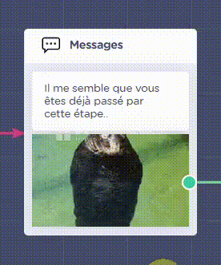
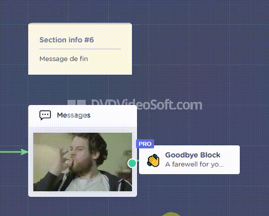

# Le WorkFlow

> Cette section explique le flux de la conversation de manière non-technique.

## Section 1 : Bienvenue

Le ChatBot commence la conversation avec un message de bienvenue, et demande à l'utilisateur de choisir une action parmis les services proposés :
Réunion avec un Avocat, Bénéficier de la NewsLetter, etc..

## Section 2 : Collecte d'information

Le ChatBot demande à l'utilisateur d'entrer ses informations (nom, prénom, email, numéro de téléphone), et les envoient à notre CRM Hubspot pour les stocker comme réponse de formulaire.

## Section 3-4 : Lancement du service choisi

> En fonction du service choisi, une chaine d'actions s'exécute.

### Réunion avec un avocat :

Le ChatBot affiche à l'utilisateur un calendrier avec les créneaux libres, et l'invite à le remplir.
Une fois le rendez-vous pris, les informations sont stockées sur Calendly, et l'évènement est créé sous les différentes plateformes de calendrier (Google Agenda ..).
Les informations de l'utilisateur sont stockées dans un Google Sheet résérvé, et un SMS de validation est envoyé à l'utilisateur.

### Ajout à la Mailing List :

Le ChatBot ajoute l'email de l'utilisateur à notre Mailing List sous MailChimp, et ajoute les informations de l'utilisateur dans un Google Sheet résérvé.

## Section 5 : Choix d'un autre service

Le ChatBot affiche un menu de redirection à l'utilisateur pour choisir parmis les autres services proposés dans la <b>section 4</b>, ou de finir la conversation.

!> Si l'utilisateur a déjà bénéficié du service choisi, le ChatBot le notifie qu'il est déjà passé par ici, et le redirige vers la <b>section 5</b> pour effectuer un autre choix.  

## Section 6 : Message de fin

Le ChatBot affiche à l'utilisateur un message de fin, et termine la conversation.
Un bouton s'affiche également, qui permet de lancer une nouvelle conversation avec le ChatBot.

