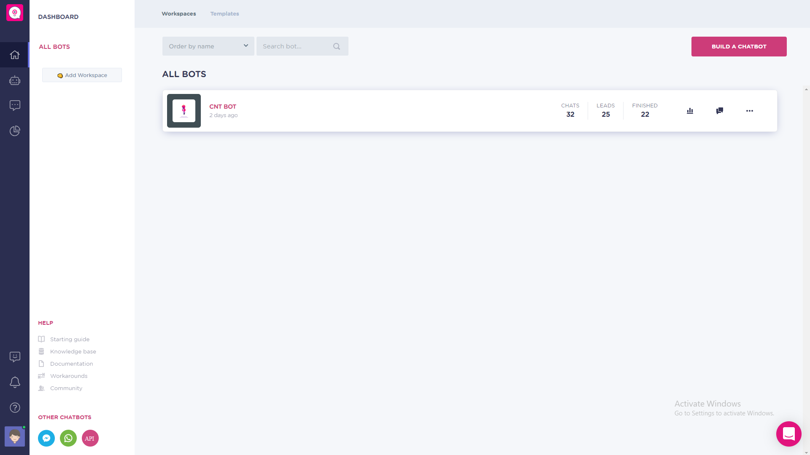
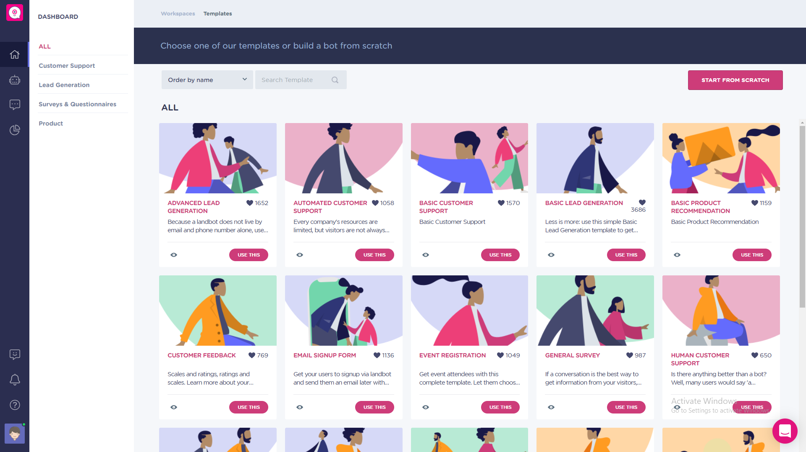
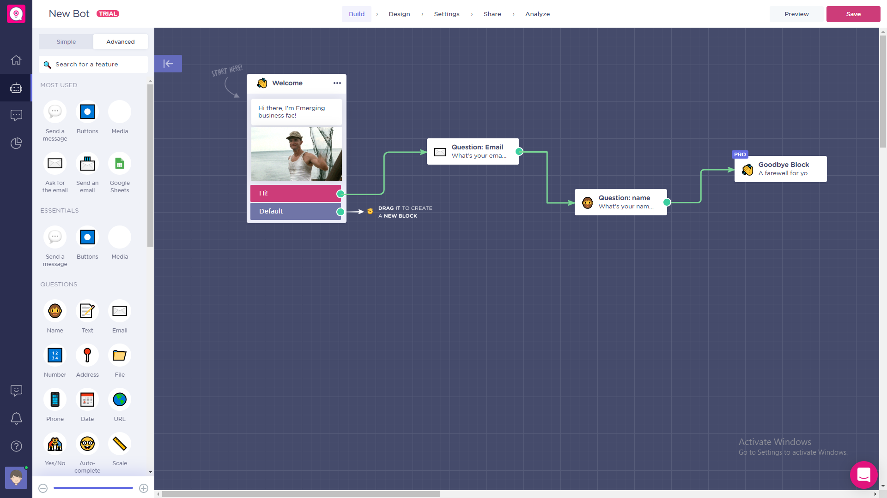
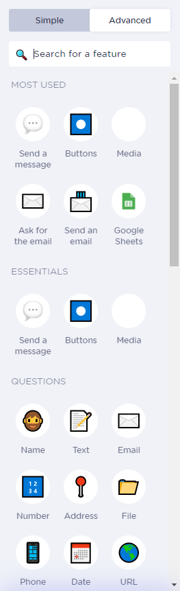
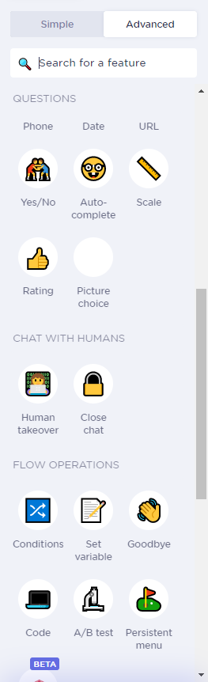
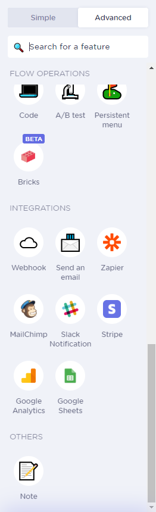

# La plateforme LandBot

> Cette section présente les différentes composantes de la plateforme Landbot.

## La page d'accueil

L'utilisateur peut consulter ses Bots existants et créer de nouveaux bots depuis cette page.

## Les templates

Plusieurs templates de chatbots sont disponibles. Chacune offre un scénario spécifique à développer par la suite.

## Création d'un ChatBot

La fenêtre de personnalisation du chatbot permet de créer des scénarios de conversations, de collecter et de manipuler les données de l'interlocuteur du Chatbot.

## Les Fonctionnalités

LandBot offre plusieurs fonctionnalités pour personnaliser les scénarios de conversations, <i>mais</i> les plus interessants sont <b>Pro</b>, et demandent d'avoir un compte professionnel.

