# Guide technique

> Ce volet explique techniquement comment marche chaque section.

## Section 1 : Bienvenue

Le bloc de début affiche un .gif puis <b>liste les services</b> à travers des boutons.

Le choix choisi est stocké dans la variable <code>@submission_type</code>, qui servira comme variable de contrôle pour le Routing.

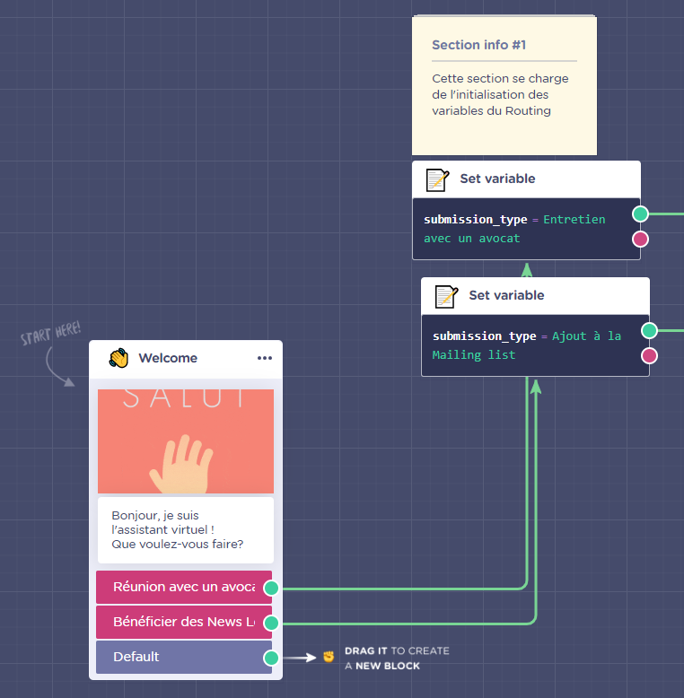

## Section 2 : Collecte d'information

La <b>section 2</b> se compose de 3 blocs :

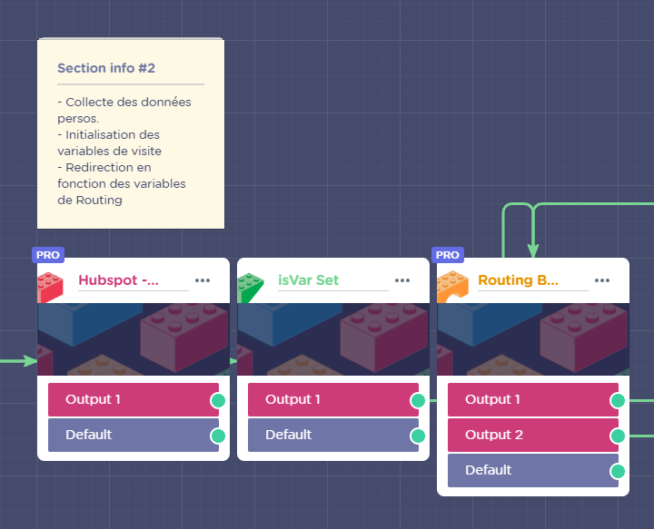

### Hubspot

En ouvrant le bloc <b>Hubspot</b>, on voit que le chatbot demande les informations de l'utilisateur et les stock dans les variables <code>@firstname</code>, <code>@lastname</code>, <code>@email</code> et <code>@phone</code>.

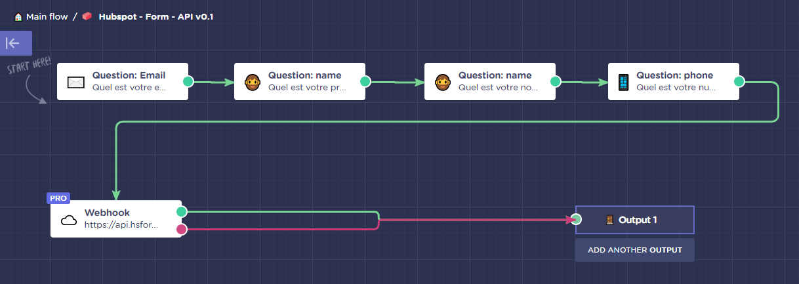

Le Webhook envoie ces informations avec une requête POST sous HTTP à un formulaire Hubspot et les insèrent dans le CRM.

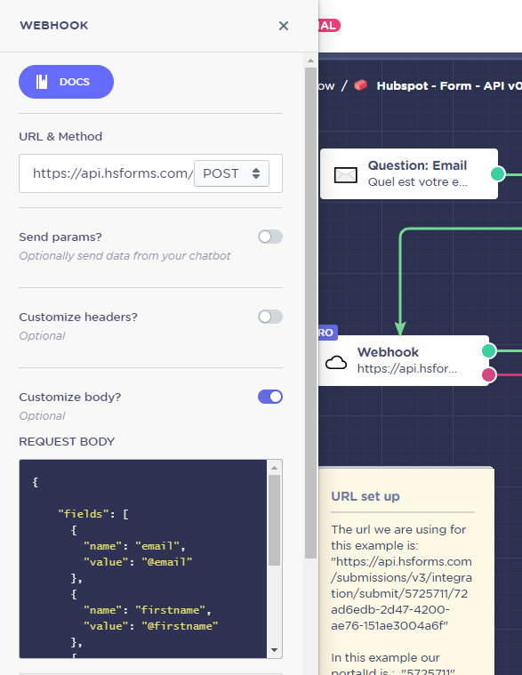

### IsVarSet

Le bloc IsVarSet initialise les variables <code>is_service</code> qui servent à noter les services que l'utilisateur a utilisé.

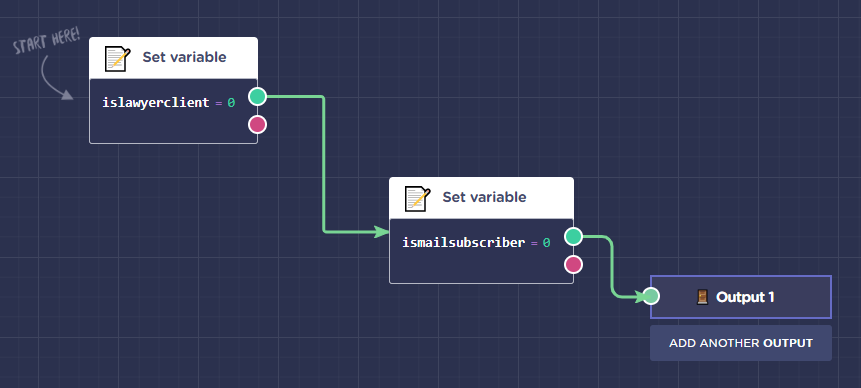

### Routing

Le bloc de Routing vérifie la valeur de la variable <code>@submission_type</code> pour rediriger l'utilisateur vers le service choisi.

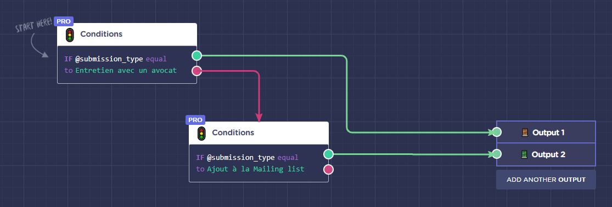

## Section 3 : Redirection

Cette section vérifie la valeur de la variable <code>is_service</code> du service en question.

<code>is_service</code>=0 veut dire que l'utilisateur n'a jamais lancé ce service, il l'autorise l'accès au service demandé.

Si <code>is_service</code> n'est pas égal à 0, c'est qu'il est déjà passé par ce service, il affiche un message d'erreur et le redirige vers la <b>section 5</b>.

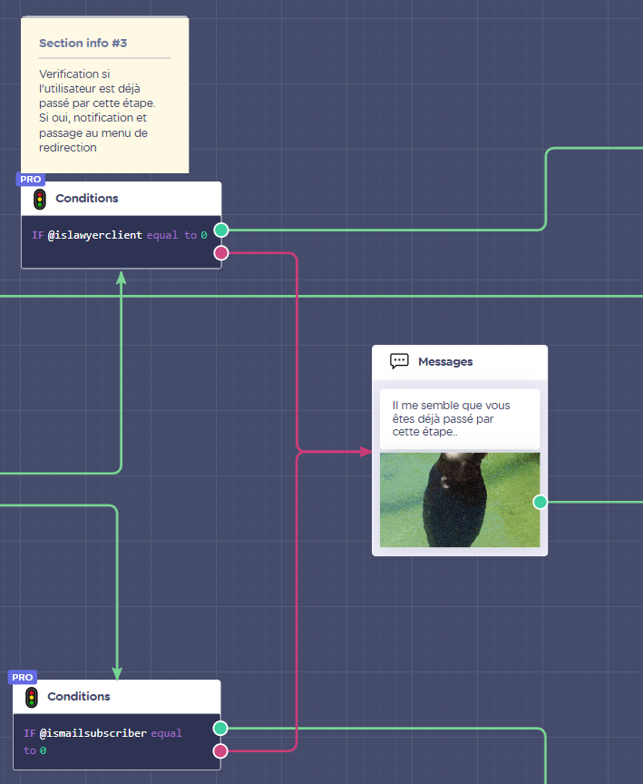

## Section 4 : Lancement du service choisi

### Section 4.1 : Prise de rendez-vous

Cette section se charge de la prise de rendez-vous.

Le ChatBot affiche un message, puis met <code>islawyerclient</code> à 1 pour noter qu'il vient de passer par ce service.

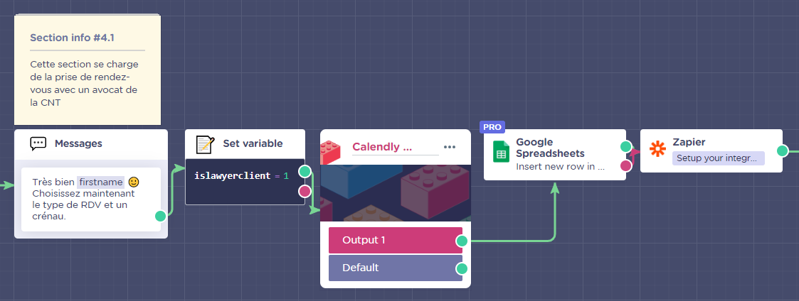

#### Calendly :

Le bloc Calendly se charge de la gestion des rendez-vous.

Il suffit de créer un modèle d'évènement sur votre compte Calendly, et de mettre votre <b>Nom de compte Calendly</b> comme valeur de la variable <code>calendlyaccount</code>

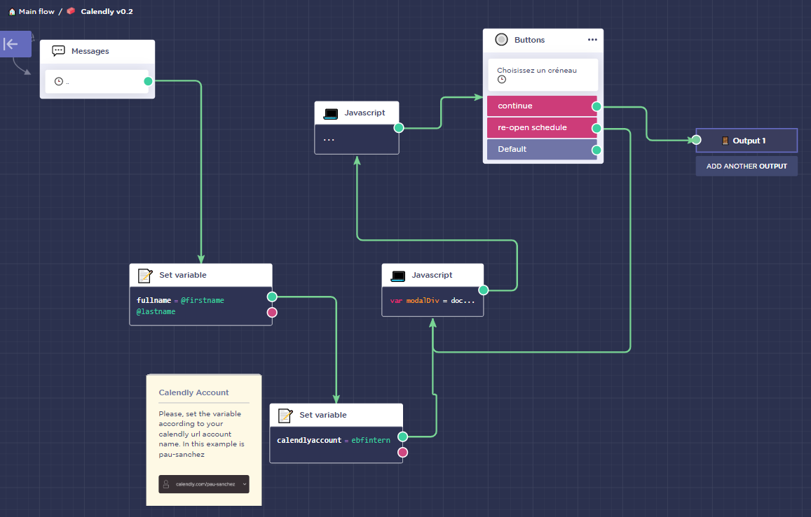

#### Google Sheets :

Les informations de l'utilisateur sont stockés sur le Google Sheet.

Il est nécessaire de connecter un compte google, de spécificer le Google Sheet, la feuille, de choisir l'action voulue, et affecter chaque variable à une colonne

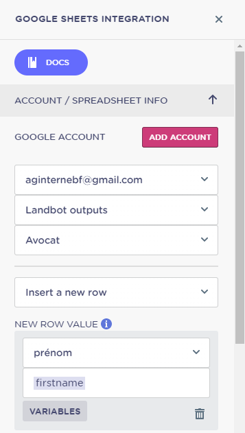

#### Zapier - Twilio :

> Zapier est un service Web qui permet aux utilisateurs finaux d’intégrer les applications Web qu’ils utilisent.

Nous intégrons ici LandBot et Twilio à travers Zapier.

Il suffit de connecter notre compte Landbot, choisir le bot et le bloc en question, et de connecter notre compte Twilio et choisir l'action qu'on veut.

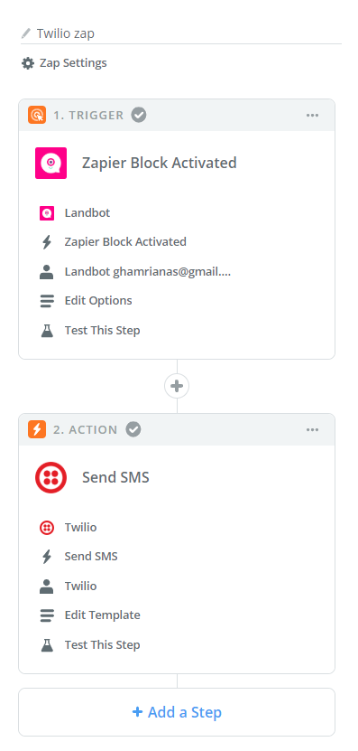

### Section 4.2 : Ajout à la Mailing List

Cette section se charge de la prise de rendez-vous.

Le ChatBot affiche un message, puis met <code>ismailsubscriber</code> à 1 pour noter qu'il vient de passer par ce service.

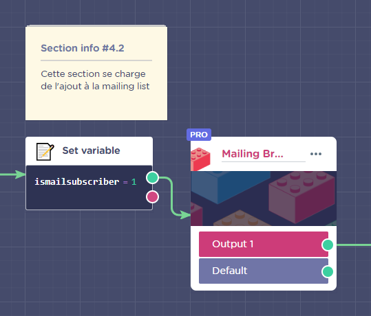

#### Mailing Brick :

Le Mailing Brick (créé manuellement) se charge de l'ajout à la mailing list sur MailChimp, puis sur Google Sheets sur une feuille différente.

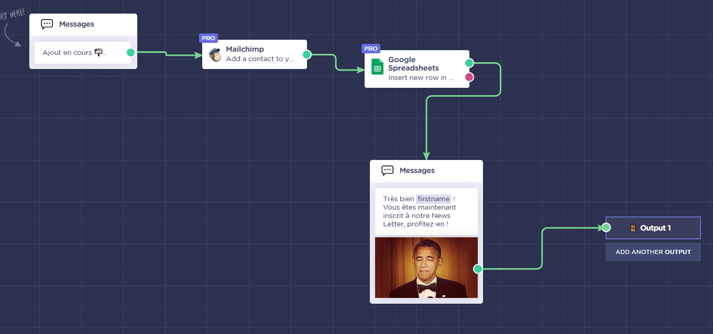

Il est nécessaire de connecter un compte MailChimp et de renseigner les informations demandées.

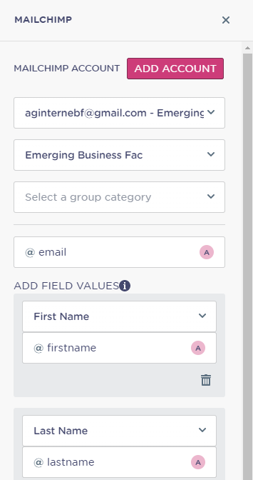

## Section 5 : Choix d'un autre service

Le <b>bloc de redirection</b> permet de rediriger l'utilisateur vers d'autres services selon son choix.

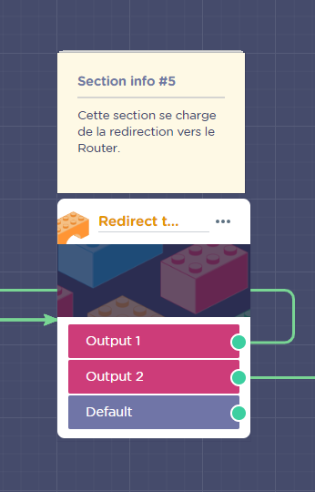

Il est composé d'un menu comme celui dans la <b>Section 1</b> plus un bouton pour quitter, qui redirige vers la <b>section 6</b> à travers <i>Output2</i>.

Le choix de l'utilisateur change la valeur de la variable <code>submission_type</code> et redirige l'utilisateur vers le bloc de <b>Routing</b>.

!> Si un service a déjà été parcouru, la <b>Section 3</b> va le rediriger vers la <b>Section 5</b> pour refaire son choix.

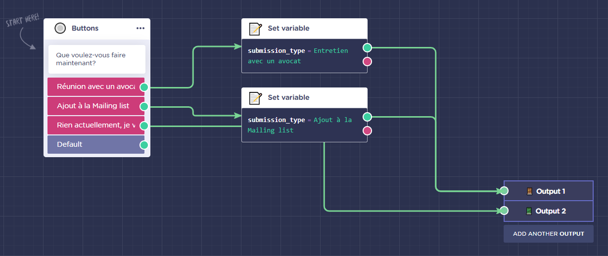

## Section 6 : Message de fin

Cette section affiche un message et met fin à la conversation avec le bloc <code>Goodbye Bloc</code>, qui affiche ensuite le bouton Recommencer.

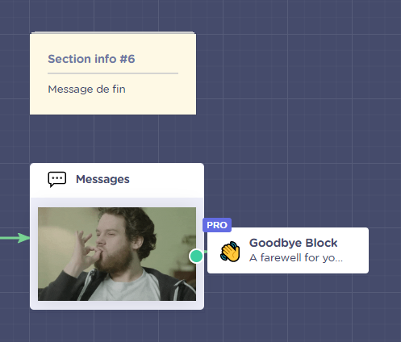